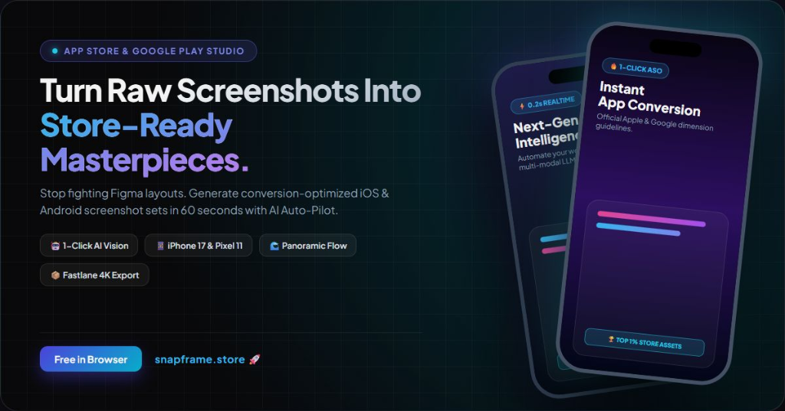
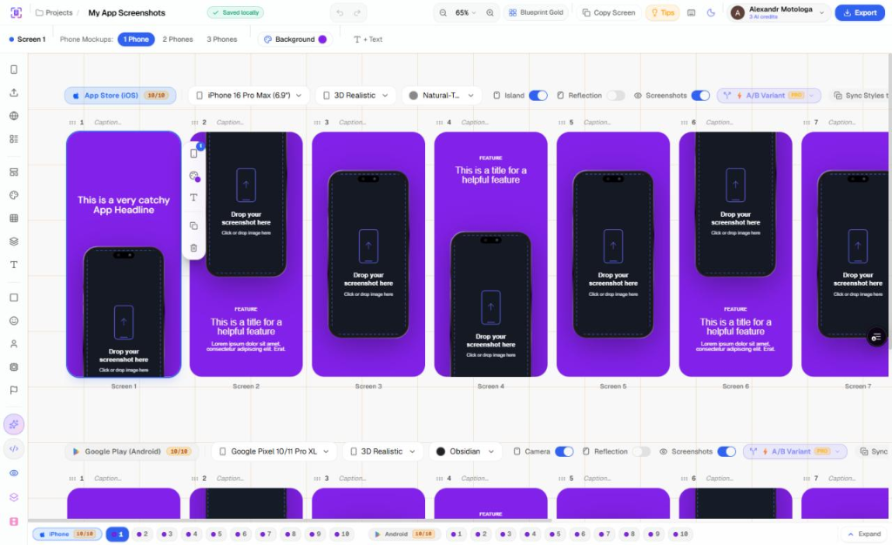
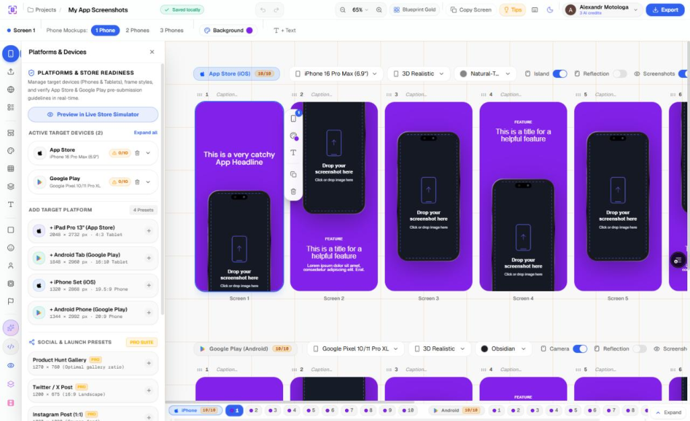
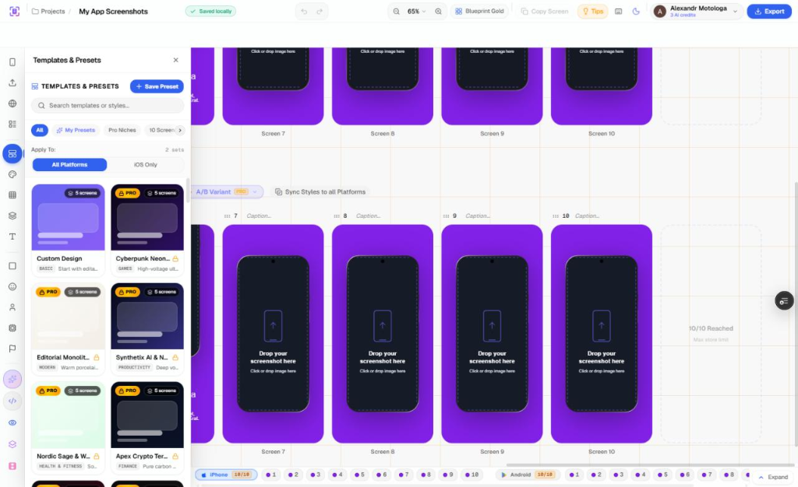

<p align="center">
  <a href="https://snapframe.store" target="_blank" rel="noopener noreferrer">
    
  </a>
</p>

<h1 align="center">SnapFrame</h1>

<p align="center">
  <b>Studio-grade App Store & Google Play Screenshot Generator powered by AI Auto-Pilot & 3D Vector Mockups</b>
</p>

<p align="center">
  <a href="https://snapframe.store"></a>
  
  
  
  
  
</p>

<p align="center">
  SnapFrame is an open-source, studio-grade screenshot editor and ASO production engine for mobile applications. Stop fighting Figma layouts: generate conversion-optimized App Store (iOS and iPadOS) and Google Play (Phone and Android Tablet) screenshot sets in under 60 seconds with 3D realistic vector device frames, continuous panoramic flow, multi-modal AI Vision auto-pilot, and one-click Fastlane export packages.
</p>

---

## Studio Preview

### Multi-Device Live Studio & Panoramic Canvas
Design complete 10-screen visual sets with simultaneous App Store (iOS) and Google Play (Android) rails, 3D realistic vector frames (Natural Titanium, Obsidian, Porcelain), floating action toolbars, and continuous panoramic background flow across slides:

<p align="center">
  
</p>

### Platforms & Store Readiness Matrix
Manage target device sets (iPhone 17/16 Pro Max, Google Pixel 10/11 Pro XL, iPad Pro 13", Android Tablet) and social media launch presets (Product Hunt Gallery, Twitter / X Posts, Instagram) with real-time pre-submission dimension verification:

<p align="center">
  
</p>

### Curated Templates & Niche Design Kits
Apply battle-tested, high-converting design systems (Cyberpunk Neon, Editorial Monolith, Synthetix AI, Nordic Sage, Apex Crypto Terminal) or save custom team presets for instant reuse across client apps:

<p align="center">
  
</p>

---

## Features


### AI tools and generation
- Structured JSON studio: Import and export complete multi-slide screenshot projects as structured JSON. Prompts can generate 5 to 10 slide decks with headlines and badge pills. See [`docs/JSON_SCHEMA.md`](./docs/JSON_SCHEMA.md).
- Automated project draft: Multimodal vision models (`gemini-3.6-flash`, `gpt-4o-mini`, `groq-llama-3.2-vision`, `mistral-pixtral`, `grok-2-vision`) inspect uploaded screenshots to draft headlines, subtitles, and matching background gradients.
- Store listing and ASO generator: Generates localized App Store and Google Play metadata with store character limit enforcement:
  - iOS: App Name (30 chars max), Subtitle (30 chars max), Promotional Text (170 chars max), Keywords (100 chars max), Description, and Release Notes.
  - Android: App Title (30 chars max), Short Description (80 chars max), Full Description, and Release Notes.
- Copywriter adjustments: Adapts copy across tones (active, minimal, benefit-focused, social proof, enterprise), shortens text under 30 characters, and offers headline alternatives.
- Screenshot palette extraction: Local color quantization (median-cut and HSL harmony) extracts color palettes directly from uploaded screenshots, with optional vision model suggestions.
- Clean status bar: Overlays a vector status bar (9:41 AM, battery indicator, signal bars, network badge) with light and dark mode toggles to meet store guidelines.
- Saliency smart framing: Client-side Sobel edge convolution scans uploaded screenshots to identify focal zones (headers, cards, bottom toolbars). It calculates optical centroids and sets frame offsets to keep headlines in the top third and prevent cutting off navigation bars.
- Multilingual localization: Translates text across 60+ languages with length constraints to prevent header overflow.
- Protected endpoints: AI routes use Firebase ID token authentication, sliding-window rate limiting, anti-SSRF filtering, and server-managed API keys.

### Device and platform support
- Apple iOS and iPadOS: iPhone 17 Pro, 16 Pro, 15 Pro, 14, and iPad Pro 13" (2048 x 2732 px).
- Google Play and Android tablets: Google Pixel 10/11 Pro XL, Pixel 10/11 Pro, Pixel 9 Pro, Samsung Galaxy S25 Ultra, S24 Ultra, Samsung Galaxy Tab S9 Ultra, Galaxy Tab S7, and Galaxy Tab A.
- Manufacturer color finishes: Exact HEX colors including Natural Titanium, Desert Titanium, Obsidian, Porcelain, Titanium Gray, and Ultramarine.
- Proportional scaling: Adding tablet sets automatically adapts and scales existing layouts from phone dimensions.

### Design and canvas tools
- Batch captions editor: Edit primary headlines and subtitles across all 10 screens in a single table with live canvas synchronization.
- Project brand kit: Save custom brand colors per project to apply across backgrounds, typography, and shapes.
- Quick text actions: One-click actions to shorten text under 30 characters, add emojis, focus on benefits, adjust tone, or generate alternatives.
- System clipboard paste (`Ctrl+V` / `Cmd+V`): Paste screenshots directly into the active device mockup without saving files locally first.
- Keyboard shortcuts: Layer creation shortcuts (`T` for Text, `S` for Shape, `M` for Mockup, `V` for Select/Deselect), arrow nudges (1px or 10px with Shift), duplicate (`Ctrl+D`), undo/redo (`Ctrl+Z` / `Ctrl+Y`), and help overlay (`?`).
- Magnetic snapping and guides: Center, margin, and layer boundary alignment guides with visual indicators.
- Native eye dropper: Sample colors directly from the canvas using the browser `EyeDropper` API.
- Continuous panoramic flow: Split gradients, waves, or wide panorama images across consecutive screens.
- Block elements: Over 30 pre-built UI elements including Dynamic Island capsules, notification banners, guarantee seals, comparison cards, and metric callouts.
- Responsive studio interface: Horizontal scroll rails with mouse wheel support, tab centering, and dedicated toolbars for each layer type.
- 3D screen deck covers: Layered deck preview on project cards showing the first screens with ambient lighting extracted from the project colors.
- Project autosave: Real-time saving status with debounced cloud persistence and header breadcrumbs for renaming.
- Typography: 20+ Google Fonts including Inter, Montserrat, Poppins, Outfit, Space Grotesk, and Playfair Display.
- Canvas engine: Consistent 2D rendering across the live editor, store simulator, clipboard copy, and ZIP export.

### Export and store submission
- Multi-platform ZIP archive: Exports into separate folders for `App Store (iPhone)/`, `App Store (iPad)/`, `Google Play (Phone)/`, and `Google Play (Tablet)/`.
- Direct folder save: Supports the Chromium File System Access API (`showSaveFilePicker`) with download fallbacks for other browsers.
- Testing variants: Generate visual variations (dark mode, studio light, vivid accent, bold layout) for store A/B tests.
- Fastlane package: Generates a ready-to-run `Deliverfile` alongside structured text files (`name.txt`, `subtitle.txt`, `description.txt`, `keywords.txt`) for command-line deployment.
- Multiple export formats: Supports lossless PNG, compressed WebP, and high-quality JPEG.
- Live store simulator: Preview screenshot sets inside mockup App Store and Google Play interfaces across phone and tablet sizes.
- Lossless video and GIF studio: Compiles H.264 MP4 videos using a WebAssembly FFmpeg pipeline (`@ffmpeg/ffmpeg`) with constant 60 FPS / 30 FPS pacing, `-pix_fmt yuv420p`, and cubic ease slide/cross-fade transitions to meet strict Apple App Store Video Preview and Google Play requirements. Also exports WebM streams and animated GIF palettes.
- Pre-submission store linter: Real-time preflight compliance audit directly in the export dialog checking Google Play prohibited rankings/pricing claims (`#1`, `Free`, `Top Rated`, review stars), Apple App Store alpha transparency, WCAG AA contrast, and search thumbnail legibility.
- Panoramic seam spanning: Pixel-perfect cross-screen layer continuity enabling device mockups, cards, and shapes to span continuously across screen boundaries ($X_{i+1} = X_i - W$).
- Official localized store badges: Vector-rendered Apple App Store and Google Play badges with native translations across 16+ languages (English, Romanian, German, French, Spanish, Japanese, Korean, Chinese, etc.).
- Marketing launch pack generator: 1-click marketing banners for Product Hunt gallery (1270×760 px), X / Twitter landscape cards (1200×675 px), and Triple Launch Pack 3-phone perspective mockups.
- AI Smart Framing: Optical saliency detection via 2D Sobel gradient convolution, centering focal points and core UI elements with 1 click in editor toolbars.
- Clipboard copy: Copy any screen directly to the clipboard at full resolution for Figma, Slack, or Notion.
- Store size guides: Built-in specifications for 2026 store requirements at `/app-store-screenshot-sizes` and `/google-play-screenshot-sizes`.

### Account tiers

| Feature | Guest | Free Registered (Google/GitHub) | SnapFrame Pro ($9/mo or $69/yr) |
| :--- | :--- | :--- | :--- |
| Project limit | 1 session project | 3 projects (stored in browser) | Unlimited projects |
| Cloud synchronization | Browser session only | Local browser storage only | Multi-device cloud sync (Firestore) |
| Project migration | None | Local projects migrate to cloud upon upgrade | Real-time sync across devices |
| AI generations | Sign-in required | 3 trial credits | Unlimited (Fair usage: 1,500/mo) |
| Batch captions editor | Sign-in required | Screens 1 to 3 | All 10 screens with batch actions |
| Brand kit palette | 1 color slot | 3 saved colors | 12 saved colors |
| Clipboard copy | Active screen | Screens 1 to 3 | All 10 screens at full resolution |
| ZIP export | Sign-in required | Up to 3 screens per set (1 platform) | All 10 screens (all platforms) |
| Multi-platform batch | Sign-in required | 1 platform | Full package (iOS, iPad, Android, Tablet) |
| Multi-language batch | Sign-in required | 1 active language | 40+ languages in organized folders |
| Fastlane metadata package | Sign-in required | Not included | Complete Deliverfile and metadata structure |
| Custom canvas and presets | Standard store sizes | Standard store sizes | Custom dimensions and social media presets |
| Testing variant generator | Not included | Not included | 4 visual variant strategies |
| Alignment guides | Included | Included | Included |
| Mockup scaling | Fixed 100% | Fixed 100% | 50% to 150% custom scaling |
| Dual theme generator | Sign-in required | Not included | One-click light and dark set generation |
| Store simulator | Sign-in required | Phone simulator (iPhone and Android) | Phone and tablet simulator |
| Mockup frame styles | Flat and titanium frames | Flat and titanium frames | 3D frames (clay, glass, neon, wireframe) |
| Video and GIF studio | Sign-in required | Included (60fps MP4, WebM, GIF) | Included |
| App icon generator | Sign-in required | Included (Xcode and Android asset packs) | Included |
| High-resolution export | Standard 1x and 2x | Standard 1x and 2x | 4K lossless export (@3x) |
| Templates | Standard templates | Standard templates | All templates and curated kits |
| Custom presets | Not included | Not included | Save custom presets and submit to community |
| Commercial license | Included | Included | Included |

### Custom presets and moderation console (`/admin`)
- Custom templates: Pro users can save active layouts, device angles, color palettes, and typography as reusable presets.
- Community submissions: Creators can submit presets to the public gallery with author attribution.
- Moderation panel:
  - Excluded from indexing (`noindex, nofollow, nocache`) and search engine sitemaps.
  - Restricted to authenticated administrator accounts.
  - Review moderation: Approve user reviews, toggle featured badges, and verify tester status.
  - Template moderation: Review submitted community templates with approval controls.

### Billing and account management
- Account dashboard (`/account`): Displays active plan status, renewal dates, AI credit logs, and payment receipts.
- Merchant of Record: Payments are processed by Paddle.com with automated invoicing and regional tax handling.
- Customer billing hub: Update payment methods, edit tax identifiers, and download invoices through `paddle.net`.
- 14-day refund window: Available for unutilized accounts within 14 calendar days of purchase.
- Resource usage policy: Generating AI content or synchronizing projects to cloud storage incurs third-party computing expenses, after which subscriptions are non-refundable.
- Cancellation: Subscriptions can be canceled at any time; access remains active through the end of the paid billing period.

## Tech stack

- Framework: Next.js 16 (App Router, Turbopack, React 19)
- Language: TypeScript (strict mode)
- Styling: Tailwind CSS
- Testing: Vitest test suite with 110+ unit tests across 18 test suites
- Video and media: WebAssembly FFmpeg (`@ffmpeg/ffmpeg`, `@ffmpeg/util`) for constant-framerate lossless H.264 MP4 encoding and animated GIF synthesis
- State management: Zustand with modular slices (selection, UI, history, content) and undo/redo stacks
- Canvas rendering: HTML5 Canvas 2D with high-DPI scaling and LRU image cache management
- Compression: JSZip and FileSaver
- AI backend: Multi-provider failover service (Google Gemini, OpenAI, Groq, Mistral, xAI Grok)
- Security: Firebase Admin token authentication, sliding-window rate limiting, and SVG proxy sandboxing

## Getting started

### 1. Clone the repository
```bash
git clone https://github.com/alexandrmotologa/snapframe.store.git
cd snapframe.store
```

### 2. Install dependencies
```bash
npm install
```

### 3. Configure environment variables
Copy `.env.example` to `.env.local`:
```bash
cp .env.example .env.local
```

Set your API keys in `.env.local`:
```env
# AI providers (Gemini and Groq provide free tiers)
GEMINI_API_KEY=your_gemini_api_key_here
GROQ_API_KEY=your_groq_api_key_here
MISTRAL_API_KEY=your_mistral_api_key_here

# Firebase configuration (Authentication and cloud storage)
NEXT_PUBLIC_FIREBASE_API_KEY=...
NEXT_PUBLIC_FIREBASE_PROJECT_ID=...
```

### 4. Run automated tests
```bash
npm test
```

### 5. Start the development server
```bash
npm run dev
```

Open [http://localhost:3000](http://localhost:3000) in your browser.

## Project structure

```
snapframe.store/
├── docs/                      # Technical documentation
│   ├── ARCHITECTURE.md        # State management, canvas pipeline, and store slices
│   ├── AI_SUPERPOWERS.md      # AI failover engine, vision analysis, and ASO generator
│   ├── DEVICES_AND_CANVAS.md  # Device models, vector frames, and tablet adaptation
│   ├── EXPORT_AND_ASO.md      # Fastlane integration, validation checks, and ZIP builder
│   ├── DEPLOYMENT.md          # Deployment guide for Vercel and Firebase
│   └── images/                # Studio screenshots, banners, and visual assets
├── public/                    # Static assets, logos, and device mockups
│   ├── logos/                 # Brand assets
│   └── mockups/               # Device frame vector assets
├── src/
│   ├── app/                   # Next.js App Router pages and API routes
│   │   ├── account/           # Account overview, subscriptions, and credit logs
│   │   ├── api/               # Server-side API endpoints (account, AI, webhooks)
│   │   ├── editor/[projectId]/# Screenshot editor workspace
│   │   ├── projects/          # Projects catalog and management
│   │   ├── pricing/           # Pricing plans and feature comparisons
│   │   ├── faq/               # Frequently asked questions
│   │   ├── refunds/           # Refund policy
│   │   ├── terms/             # Terms of service
│   │   ├── privacy/           # Privacy policy
│   │   └── page.tsx           # Home page
│   ├── components/            # React UI and editor components
│   │   ├── auth/              # Authentication dialogs and user menu
│   │   ├── editor/            # Canvas, panels, toolbars, and export modals
│   │   ├── dashboard/         # Project cards and dashboard footer
│   │   └── ui/                # Base UI elements
│   └── lib/                   # Shared utilities, store, and rendering logic
│       ├── ai/                # AI provider integration service
│       ├── devices.ts         # Device models and color specifications
│       ├── renderScreenToCanvas.ts # Canvas 2D rendering pipeline
│       ├── store/             # Zustand state management slices
│       └── types.ts           # TypeScript type definitions
├── .env.example               # Environment variable template
└── package.json
```

## Documentation

For technical details, see the [`docs/`](./docs/) directory:
- [Technical architecture and state model](./docs/ARCHITECTURE.md)
- [AI provider architecture and tools](./docs/AI_SUPERPOWERS.md)
- [Devices, tablets, and vector frames](./docs/DEVICES_AND_CANVAS.md)
- [Export package and ASO guide](./docs/EXPORT_AND_ASO.md)
- [Deployment on Vercel and Firebase](./docs/DEPLOYMENT.md)

## Contributing

Please review [CONTRIBUTING.md](CONTRIBUTING.md) for guidelines on code style, component development, and pull requests.

## License

This repository is licensed under the Business Source License 1.1 (BSL 1.1). You may evaluate, test, and contribute to the code, but you may not use it to operate a competing commercial screenshot service. See the [LICENSE](./LICENSE) file for terms.